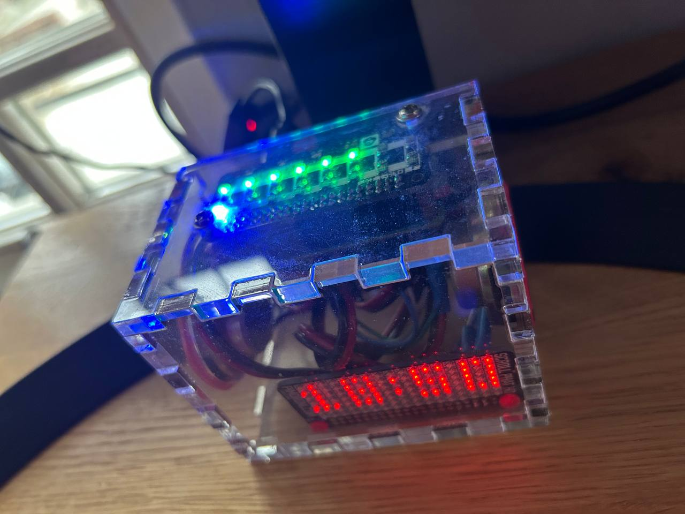
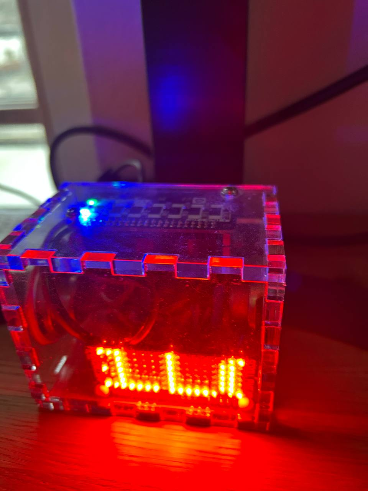

# raspiclock

Just a small python script to set up a clock I built some time ago.
It is a pizero + Pimoroni's scrollphat led and their phatbeat audio output.

I use it to show the day of the week, the percentage of the hour, the time
and for some long running jobs running on other machines to tell me they completed.

